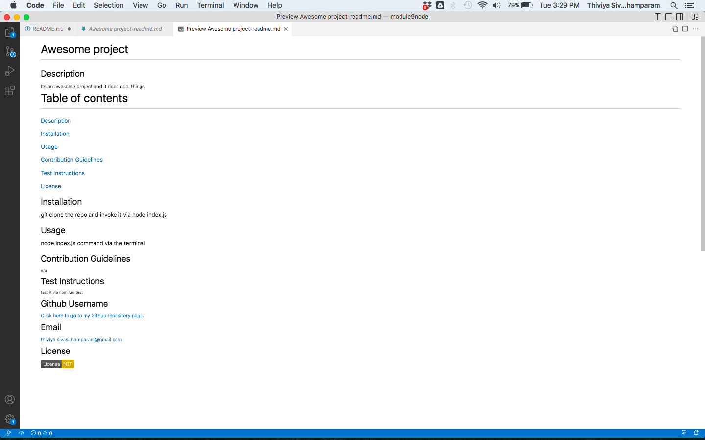

# 09 Node.js Challenge: Professional README Generator

## The Task

To create a command-line application that dynamically generates a professional README.md file from a user's input using the [Inquirer package](https://www.npmjs.com/package/inquirer/v/8.2.4). This allows the project creator to devote more time to working on the project.

The application will be invoked by using the following command:

```bash
node index.js
```

## User Story

```md
AS A developer
I WANT a README generator
SO THAT I can quickly create a professional README for a new project
```


### Walkthrough Video: 
https://drive.google.com/file/d/1U5z3J9WxZftCUjJbLCMyBLqSku_xxiTl/view

### Github Repository Link:
https://github.com/thivsiv28/ReadmeGenerator


### Sample README :



